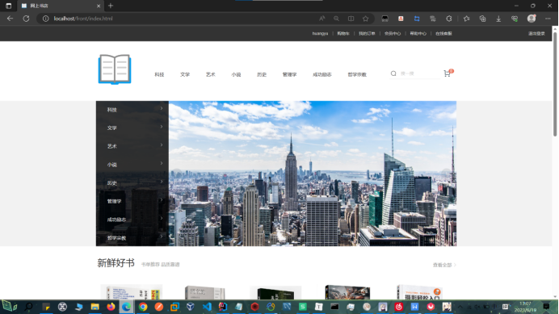
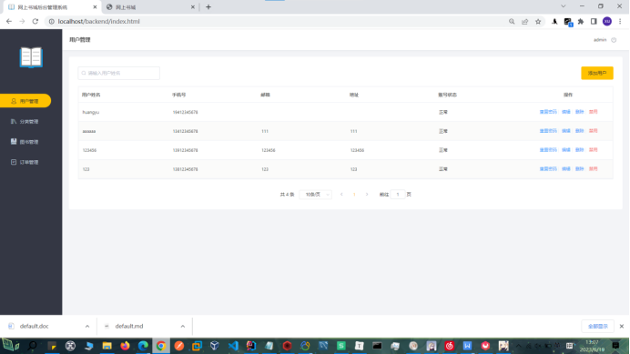
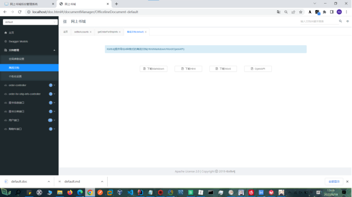
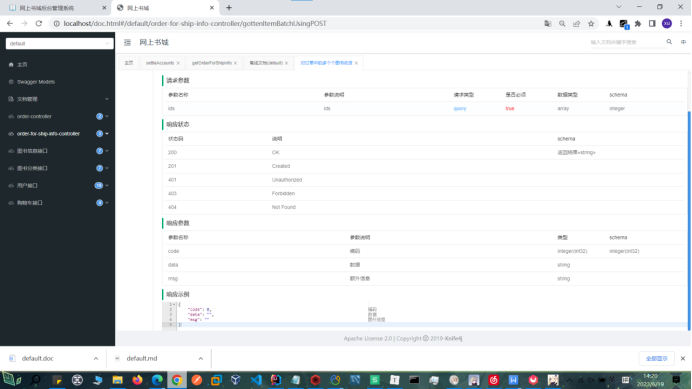

# 网上书城
 
## 1. 介绍
网上书城项目，分为前台用户展示页面，后台管理页面。后端语言为Java。主要技术栈为SpringBoot + Vue + Element-Ui

## 2. 项目环境
开发工具：Idea、Maven  
语言：Java1.8  
数据库：MySQL8.x、Redis3.0  

## 3. 项目部署
#### 0. 将sql文件夹下的sql文件导入到mysql数据库
#### 1. 启动Redis服务端，默认密码为空，端口6379(默认)
#### 2. 启动MySQL服务端，默认密码为root，端口3306(默认)
#### 3. 使用Idea打开项目，通过Maven下载pom文件中对应的依赖
#### 4. 启动项目

## 4. 项目展示
前台展示页面

后台管理页面

接口文档页面

## 5. 致谢
在下面的项目原有基础上, 添加表设计, 更改表字段, 添加订单模拟生成, 订单收货功能
https://gitee.com/lcy-mayun/online-bookstore
