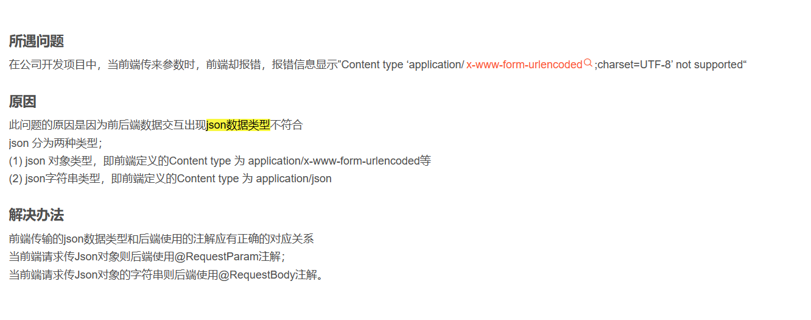

INSERT INTO `bookstore`.`shipments`(`id`, `shipment_date`, `order_item_id`, `send_from`, `send_to`, `is_deleted`, `shipment_gotten_date`) VALUES (1670032999632076801, '2023-06-17 19:37:49', '1670032978429870082', '北京市', 'xx省xx市xx县xxx村x组xxx号', 1, '2023-06-17 20:06:11');
INSERT INTO `bookstore`.`shipments`(`id`, `shipment_date`, `order_item_id`, `send_from`, `send_to`, `is_deleted`, `shipment_gotten_date`) VALUES (1670032999632076802, '2023-06-17 19:37:49', '1670032978429870083', '北京市', 'xx省xx市xx县xxx村x组xxx号', 1, '2023-06-17 20:06:11');
INSERT INTO `bookstore`.`shipments`(`id`, `shipment_date`, `order_item_id`, `send_from`, `send_to`, `is_deleted`, `shipment_gotten_date`) VALUES (1670032999632076803, '2023-06-17 19:37:49', '1670032978429870084', '北京市', 'xx省xx市xx县xxx村x组xxx号', 1, '2023-06-17 20:06:11');
上面是我的表数据, 但是当我使用SELECT * FROM shipments WHERE order_item_id = 1670032978429870082进行查询时, 查到的不止一条数据, 而是上面三条, 是什么原因呢

原因就是 '1670032978429870084', 你的order_item_id是varchar, 而你查询的时候没有带单引号, 自然就乱搞了, 要么你重新设计数据表为bigint, 要么加单引号